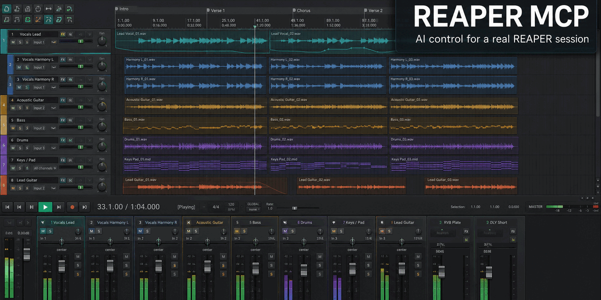
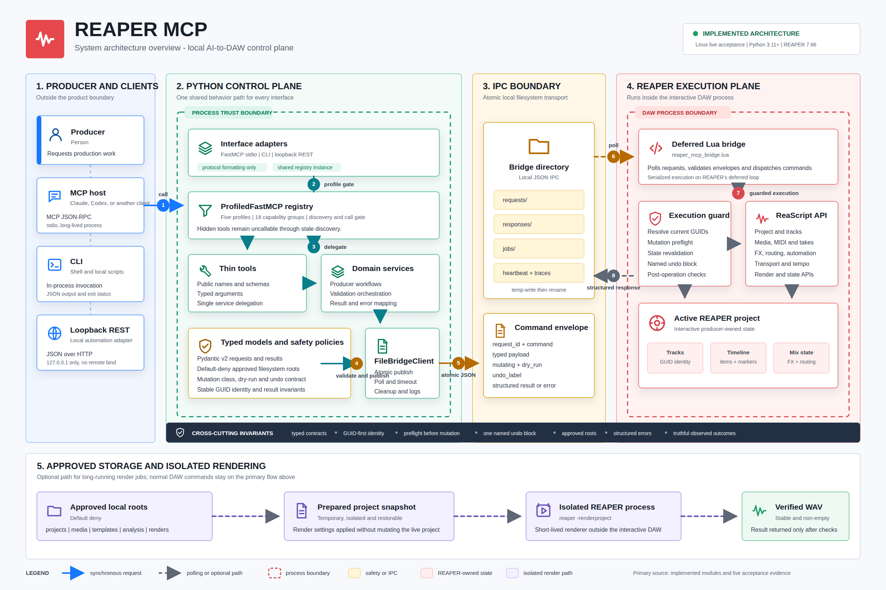

<p align="center">
  
</p>

<!-- Replace the hero image with the product demo video when it is ready. -->

<h1 align="center">REAPER MCP</h1>

<p align="center">
  A safe, producer-focused MCP server for controlling REAPER with AI,
  scripts, and the command line.
</p>

<p align="center">
  <a href="https://github.com/danishaft/reaper-mcp/actions/workflows/ci.yml">
    
  </a>
  <a href="https://github.com/danishaft/reaper-mcp/blob/main/LICENSE">
    
  </a>
  
  
  
  
  
  
  
</p>

<p align="center">
  <a href="#quick-start">Quick start</a> ·
  <a href="#interfaces">Interfaces</a> ·
  <a href="CONTRIBUTING.md">Contributing</a>
</p>

## What it is

REAPER MCP connects an AI client or local script to a real REAPER project. It
keeps the producer in control with typed requests, stable project identities,
preflight validation, one-step undo, default-deny file policies, and truthful
structured results.

The server runs locally. Python owns the MCP tools, services, safety checks,
profiles, and workflows. A Lua bridge runs inside REAPER and executes the
approved ReaScript commands.

## What producers can do

| Producer workflow | Representative tools | What it enables |
| --- | --- | --- |
| **Build** | `create_song_starter`, `create_track`, `create_midi_pattern` | Start a song with tracks, MIDI parts, and a region |
| **Arrange** | `move_media_item`, `split_media_item`, `list_fixed_lanes`, `select_fixed_lane` | Shape sections and safely audition one complete REAPER fixed lane |
| **Edit MIDI** | `add_midi_notes`, `quantize_midi_notes`, `humanize_midi_notes`, `snap_midi_notes_to_scale` | Write, correct, and vary musical performances |
| **Mix** | `set_track_volume`, `add_fx`, `setup_sidechain`, `configure_reference_track` | Balance tracks, build guarded processing chains, and audition references outside master FX |
| **Tune vocals** | `list_vocal_tuning_providers`, `preview_vocal_tuning_plugin_plan`, `apply_vocal_tuning_plugin_plan` | Apply approved scale-aware pitch correction through a verified, undoable provider |
| **Manage projects** | `save_project`, `apply_track_template`, `freeze_track`, `undo` | Save, template, freeze, and recover project changes |
| **Analyze** | `measure_audio_file`, `analyze_audio_program` | Measure loudness, peaks, DC offset, frequency-band balance, and silence |
| **Master** | `create_mastering_session`, `preview_mastering_plan`, `prepare_mastering_audition` | Guard master-FX plans, render measured candidates, and prepare level-matched A/B projects |
| **Deliver** | `deliver_mastering_candidate`, `create_mastering_codec_preview`, `create_mastering_version_set`, `prepare_mastering_album` | Verify PCM WAVs, measure decoded AAC/MP3/Opus previews, group approved versions, and prepare albums |
| **Render** | `render_project`, `render_project_start`, `render_project_result` | Produce approved WAV output with completion checks |

The default `minimal` profile exposes 26 focused tools. Opt into `production`
for 148 stable tools or `full` for all 172 tools, including experimental vocal
tuning, mastering, and render lifecycle operations.

## Interfaces

All interfaces use the same services, profiles, safety rules, error model, and
Lua bridge. They are different ways to reach the same product.

| Interface | Best for | Start |
| --- | --- | --- |
| **MCP** | Claude, Codex, Cursor, and other AI clients | `reaper-mcp` |
| **CLI** | Producers, shell scripts, automation, and CI | `reaper-mcp-cli` |
| **REST** | Local apps, integrations, and future video or web clients | `REAPER_MCP_TRANSPORT=http reaper-mcp` |

## Quick demo

With REAPER open and the Lua bridge running, a producer can create and inspect a
song starter through the same tools an AI client uses. The example below shows
the interaction shape; returned GUIDs are then used for later guarded edits.

```text
Producer: Create an 8-bar A-minor song starter and show me what was created.

1. create_song_starter
   {"name":"A-minor demo","bars":8,"root_note":69,"mode":"minor"}
   -> Creates Drums, Bass, Chords, and Lead parts plus one song region.
      The response returns stable track, item, take, and region identities.

2. get_project_snapshot
   {}
   -> Returns the current project, transport state, tracks, markers, and regions.

3. list_available_fx
   {}
   -> Returns the FX installed in this REAPER profile.

4. list_track_fx
   {"track_guid":"<drums-track-guid>"}
   -> Reads the drum track FX chain without changing the project.
```

Every write is validated before execution and appears as one named REAPER undo
step. Read the returned identities instead of guessing from track positions.

## Quick start

You can connect REAPER MCP in a few minutes. You need REAPER and
[`uv`](https://docs.astral.sh/uv/getting-started/installation/). Linux with
REAPER 7.66 is the live-verified environment.

### 1. Install the server and bridge

Install the Python package as an isolated command-line tool, then copy its
packaged Lua bridge into your REAPER resource directory:

```bash
uv tool install danishaft-reaper-mcp
reaper-mcp-install
```

The installer prints the exact bridge path and the remaining REAPER steps. It
backs up an older bridge when the installed content differs.

### 2. Activate the bridge in REAPER

Open REAPER and complete these steps once:

1. Choose **Actions > Show action list**.
2. Choose **New action > Load ReaScript**.
3. Select the `reaper_mcp_bridge.lua` path printed by the installer.
4. Select `reaper_mcp_bridge.lua` in the action list, then choose **Run**.

Run the bridge again after restarting REAPER. You can add it to a REAPER
startup action after confirming the first connection.

### 3. Start and verify the server

Keep REAPER open with the bridge running. Verify the connection before changing
a project:

```bash
reaper-mcp-cli health
```

Then start the MCP server:

```bash
reaper-mcp
```

A successful result reports both the Python server and the REAPER bridge as
available. Continue to [MCP setup](#mcp-setup) to connect your AI client.

## Platform support

The Python package and installer contain platform path handling. GitHub CI runs
the unit, contract, lint, format, and package checks on all three platforms,
but live DAW acceptance is narrower than source compatibility. Do not treat an
unverified platform as production-ready until REAPER has been exercised there.

| Platform | REAPER integration | Status |
| --- | --- | --- |
| **Linux** | CI plus REAPER 7.66, native Lua bridge, isolated render path | Live verified |
| **macOS** | CI and installer path handling; live REAPER run pending | CI tested, DAW unverified |
| **Windows** | CI and installer path handling; live REAPER run pending | CI tested, DAW unverified |

## Available tool surface

The server registers 172 tools and exposes 26 focused tools in the default
`minimal` profile. Use discovery instead of memorizing the complete list.

```bash
reaper-mcp-cli tools --pretty
reaper-mcp-cli capabilities --pretty
```

The `production`, `midi`, and `mixing` profiles provide larger task-specific
surfaces. `mixing` includes experimental vocal tuning; `full` also exposes
experimental mastering and render lifecycle operations. The tuning workflow
executes supplied note-segment corrections through stable REAPER take-pitch
controls. It can insert x42 Auto Tune first and directly set its documented
root-scale note mask, correction, smoothing, bias, tuning, fast mode, and wet
controls, or recall an engineer-authored ReaTune preset without editing hidden
plugin state. It does not detect the song key or claim formant-safe correction.
Mastering has local unit, FFmpeg, isolated-child REAPER, Linux
stock master-FX coverage, and one complete Codex-to-MCP isolated mastering
acceptance run. The official EBU v5.0 compliance run passes the selected Tech
3341 loudness and true-peak cases. Retained engineer listening evidence,
deterministic scoring of captured client traces, and macOS/Windows REAPER
acceptance remain pending.

## MCP setup

Add the server to an MCP client that supports stdio transport:

```json
{
  "mcpServers": {
    "reaper-mcp": {
      "command": "uvx",
      "args": [
        "--from",
        "danishaft-reaper-mcp",
        "reaper-mcp"
      ],
      "env": {
        "REAPER_MCP_BRIDGE_DIR": "/tmp/reaper-mcp-bridge"
      }
    }
  }
}
```

To work on the implementation instead of the released package, clone the
repository and point the client at the checkout:

```bash
git clone https://github.com/danishaft/reaper-mcp.git
cd reaper-mcp
uv sync --locked
uv run reaper-mcp-install
uv run reaper-mcp
```

The server exposes the `minimal` profile by default. Use the profile tools or
set `REAPER_MCP_TOOL_PROFILE` to choose `production`, `midi`, `mixing`, or
`full`.

## CLI usage

The CLI covers every visible MCP tool through `call`. The aliases are shortcuts
for common producer operations; they do not create a second implementation.

```bash
# Discover the active tool surface.
reaper-mcp-cli tools --pretty

# Call any tool with a JSON object.
reaper-mcp-cli call set_tempo --json '{"bpm": 96}'

# Use readable producer-facing aliases.
reaper-mcp-cli project snapshot
reaper-mcp-cli tracks list
reaper-mcp-cli transport play
reaper-mcp-cli transport stop

# Use the complete profile when an experimental tool is required.
reaper-mcp-cli --profile full tools --pretty
```

Use `--arg key=value` for simple scalar arguments and `--json` for nested
requests. Output is compact JSON by default and supports `--pretty`.

## REST usage

The REST adapter is optional and loopback-only because it has no authentication
layer. It reuses the MCP registry and returns the same structured tool results.

```bash
export REAPER_MCP_TRANSPORT=http
export REAPER_MCP_HTTP_HOST=127.0.0.1
export REAPER_MCP_HTTP_PORT=8765
reaper-mcp
```

Available endpoints:

```text
GET  /api/health
GET  /api/tools
POST /api/tools/{tool_name}
```

Example:

```bash
curl http://127.0.0.1:8765/api/tools/get_active_profile
curl -X POST http://127.0.0.1:8765/api/tools/get_project_snapshot \
  -H 'content-type: application/json' \
  -d '{}'
```

## Safety model

The bridge and services enforce the following rules before REAPER executes a
mutation:

- Stable REAPER GUIDs identify tracks, items, takes, FX, envelopes, and sends.
- Reference tracks can bypass master FX through a verified direct hardware
  send created in one undoable routing operation.
- Mutations are validated and wrapped in named REAPER undo actions.
- Stale target fingerprints return structured conflicts instead of guessing.
- Audio, project, template, analysis, and render paths use explicit allowlists.
- Template deletion requires the SHA-256 returned by a fresh template listing.
- Render success requires a stable, non-empty output and verified restoration.
- Hidden profile tools cannot be called through stale client discovery.
- A timed-out mutation reports an uncertain outcome and must be refreshed
  before retrying.
- Bridge failures report structured errors instead of claiming success.

## Configuration

Runtime settings use the `REAPER_MCP_` prefix. The important paths are:

| Variable | Purpose |
| --- | --- |
| `REAPER_MCP_BRIDGE_DIR` | Shared Python and Lua bridge directory |
| `REAPER_MCP_TOOL_PROFILE` | Active tool profile |
| `REAPER_MCP_TRANSPORT` | `stdio` or `http` |
| `REAPER_MCP_ALLOWED_MEDIA_SOURCE_ROOTS` | Audio files that may be inserted |
| `REAPER_MCP_ALLOWED_PROJECT_ROOTS` | Projects that may be saved as |
| `REAPER_MCP_ALLOWED_RENDER_ROOTS` | Directories allowed for WAV output |
| `REAPER_MCP_ALLOWED_TEMPLATE_ROOTS` | Directories allowed for templates |
| `REAPER_MCP_ALLOWED_AUDIO_ROOTS` | Audio files allowed for analysis |
| `REAPER_MCP_REAPER_EXECUTABLE` | REAPER binary used by isolated rendering |
| `REAPER_MCP_FFMPEG_EXECUTABLE` | FFmpeg binary used for EBU R128 measurement |
| `REAPER_MCP_AUDIO_MEASUREMENT_TIMEOUT_SECONDS` | Per-file meter timeout |
| `REAPER_MCP_AUDIO_MEASUREMENT_MAX_OUTPUT_BYTES` | Meter diagnostic output cap |

All allowlists default to empty. See the [full configuration](#configuration)
and [engineering standards](docs/reaper-mcp-engineering-standards.md) for the
complete configuration contract.

## Architecture

REAPER MCP has one Python control plane and one execution boundary inside
REAPER. MCP, CLI, and REST calls converge on the same tool registry, services,
validation, safety rules, and bridge client. An interface never gets a separate
implementation of a DAW operation.

[](assets/reaper-mcp-system-architecture.svg)

Open the image for the full-resolution architecture map. The overview also has
a version-controlled
[Mermaid source](docs/diagrams/reaper-mcp-system-architecture.mmd) and a native
editable
[Excalidraw board](docs/diagrams/reaper-mcp-system-architecture.excalidraw).

### What happens on a tool call

1. The client calls a visible tool through MCP, the CLI, or loopback REST.
2. The profile and capability gate decide whether that tool is exposed.
3. The tool and service validate the request and enforce path and mutation
   policies before bridge execution.
4. The bridge client writes an atomic JSON envelope with a request ID,
   mutation classification, dry-run flag, and undo label.
5. The Lua bridge polls the request, validates it again at the REAPER boundary,
   resolves GUIDs against current project state, executes the ReaScript
   operation, and writes a structured response. Mutating commands run inside
   one REAPER undo block.
6. Python verifies the response request ID, normalizes the response or stable
   error, then returns it unchanged in meaning through the selected interface.

Synchronous commands use `requests/` and `responses/`. Long-running render
operations use `jobs/`, so the client can start a job, inspect its status, and
read a completed result without confusing a timeout with a successful render.

### Responsibility boundaries

| Layer | Owns | Does not own |
| --- | --- | --- |
| **Adapters** | MCP, CLI, and HTTP protocol formatting | DAW behavior or safety decisions |
| **Tools** | Public names, schemas, and thin dispatch | Direct filesystem or REAPER calls |
| **Services** | Producer workflows, validation, and result shaping | Lua or ReaScript details |
| **Bridge client** | Request files, polling, timeouts, and cleanup | Musical decisions or project mutation |
| **Lua bridge** | REAPER execution, GUID resolution, undo blocks, and responses | Client-specific protocol behavior |

This split makes the important guarantees visible: all interfaces share one
behavior path, invalid or disallowed work is rejected before bridge execution,
and every response identifies what actually happened.

Git history preserves the delivery sequence. Executable unit and opt-in
integration tests provide the verification record.

## Verification and limitations

The current acceptance evidence covers the bridge, project and track
operations, transport, media, MIDI, FX, routing, automation, takes,
arrangement, tempo, templates, analysis, workflows, interfaces, and isolated
project rendering on Linux with REAPER 7.66. A July 28 targeted run also covers
stock ReaEQ, ReaComp, and ReaLimit on the master bus plus guarded mastering
plan preview, apply, and undo. An August 4 isolated run covers guarded REAPER 7
whole-lane selection, stale-layout rejection, postcondition checks, and undo.

Run the local checks without REAPER:

```bash
uv run pytest
uv run ruff check .
uv run ruff format --check .
```

Live acceptance is opt-in and requires an isolated REAPER instance with both
the bridge and acceptance-probe Lua scripts running:

```bash
mkdir -p .private
REAPER_MCP_LIVE_TEST=1 \
REAPER_MCP_BRIDGE_DIR=/tmp/reaper-mcp-bridge \
uv run pytest tests/integration \
  --junitxml=.private/live-reaper-acceptance.xml
```

The ignored JUnit XML file is a machine-readable local record of the live run.

Known limitations are deliberate and documented:

- macOS and Windows have no live REAPER acceptance evidence yet.
- The native render lifecycle remains experimental because action `42230` can
  block the Lua event loop. The isolated external render path is verified.
- `set_fx_preset` remains unverified when the installed test FX exposes no
  preset.
- Vocal tuning does not detect the song key. x42 Auto Tune has a verified
  parameter contract on Linux but no formant correction; ReaTune requires an
  engineer-authored named preset. The take-pitch bridge command still needs
  live REAPER acceptance.
- Fixed-lane tools inspect and select complete lanes. Swipe-comp area creation
  and automatic phrase comping remain out of scope because REAPER does not
  expose comp areas as stable, directly addressable API objects.
- The Lua bridge must be running inside REAPER before a tool can execute.
- Plugin UI automation, audio-rate control, and cloud collaboration are out
  of scope.

The opt-in suite under [`tests/integration/`](tests/integration/) is the
executable source for live REAPER acceptance.

## Demo projects

The [demo directory](demo/) contains lightweight REAPER project fixtures and
source notices. Downloaded audio and generated peak files stay local because
they are large or subject to separate distribution terms.

## Project layout

The repository separates public interfaces, producer logic, typed contracts,
REAPER execution, tests, and release documentation.

```text
.
|-- src/reaper_mcp/
|   |-- server.py             MCP composition root
|   |-- cli.py                CLI adapter
|   |-- rest.py               loopback REST adapter
|   |-- profiles.py           profiles and capability gates
|   |-- tools/                thin public tool handlers
|   |-- services/             producer workflows and business logic
|   |-- models/               typed request and result schemas
|   `-- bridge/               Python bridge transport
|-- lua/
|   |-- reaper_mcp_bridge.lua REAPER-side dispatcher and runtime
|   `-- reaper_mcp_bridge_modules/
|       |-- automation_navigation.lua
|       |-- command_execution.lua
|       |-- fx_arrangement_tempo.lua
|       |-- media_midi.lua
|       |-- project_routing_transport.lua
|       |-- render.lua
|       `-- vocal_tuning.lua
|-- tests/
|   |-- unit/                 tests without REAPER
|   `-- integration/          opt-in live REAPER acceptance
|-- docs/                     engineering standards and architecture sources
|-- demo/                     local producer workflow fixtures
|-- assets/                   README and product media
|-- .github/workflows/
|   |-- ci.yml                Linux, macOS, and Windows CI
|   `-- release.yml           tagged source and wheel releases
|-- pyproject.toml            package metadata and tool configuration
|-- uv.lock                  reproducible dependency lockfile
`-- README.md                product overview and usage guide
```

## Releases and contribution

Tagged releases publish `danishaft-reaper-mcp` to PyPI through Trusted
Publishing, then attach the same source distribution and wheel to the
[GitHub release](https://github.com/danishaft/reaper-mcp/actions/workflows/release.yml).
The package still requires a local REAPER installation and a compatible Lua
bridge; it is not a bundled REAPER application.

Read [CONTRIBUTING.md](CONTRIBUTING.md) for development checks and live
acceptance requirements. User-visible changes are tracked in
[CHANGELOG.md](CHANGELOG.md).

## License

REAPER MCP is available under the MIT License. See [LICENSE](LICENSE) and
[THIRD_PARTY_NOTICES.md](THIRD_PARTY_NOTICES.md) for attribution details.
