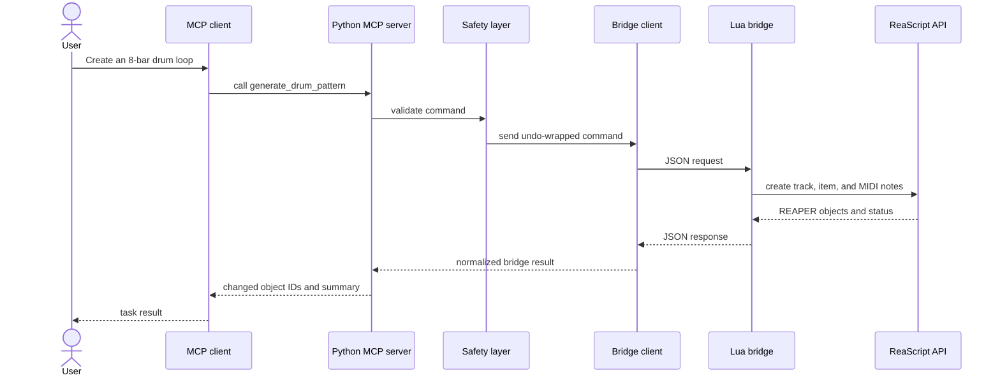
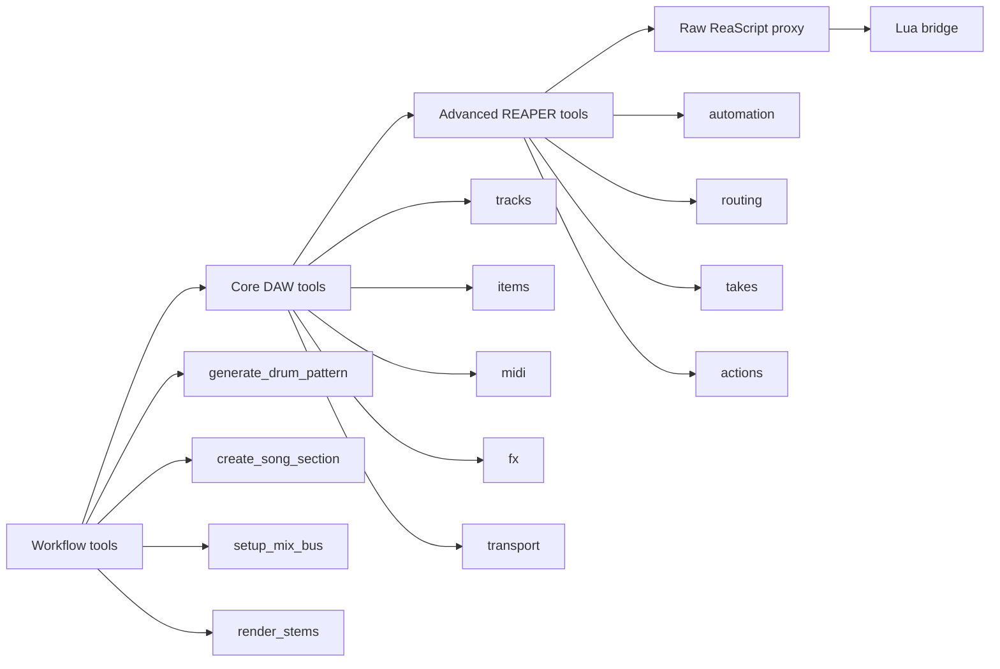

# REAPER MCP product and architecture spec

This document defines the product, architecture, safety model, and MVP scope for
a production-grade REAPER MCP server. It is the main source of truth before
implementation starts.

> **Note:** This document describes the implemented core and the selected
> release direction. The product reality audit records live acceptance.

## Background

REAPER is a deep, scriptable digital audio workstation. The ReaScript API gives
developers broad control over tracks, media items, MIDI, FX, markers, regions,
rendering, project state, and many other workflows.

Existing REAPER MCP projects prove the opportunity, but each has tradeoffs:

- `reaper-reapy-mcp` is compact, practical, and focused on useful MCP tools.
- `total-reaper-mcp` is broader and uses a native Lua bridge pattern, but it has
  a much larger surface area and more operational complexity.

The product combines the strongest ideas from both approaches without
rebuilding solved behavior. It adapts MIT-licensed implementations where they
fit and custom-builds only the identity, safety, architecture, and reliability
needed to improve on them.

## Problem

AI assistants need a reliable way to control REAPER, but raw DAW automation is
easy to make unsafe, noisy, or confusing.

The core problems are:

- Raw ReaScript functions are too numerous for default LLM tool exposure.
- Index-based object references break when tracks or items move.
- Mutating operations can damage a project if they are not undoable.
- Existing MCP servers often mix transport, bridge, tool, and workflow logic.
- Users need musical workflows, not only low-level API calls.

## Why now

MCP gives AI assistants a standard way to call local tools. REAPER already has
deep scripting support. Combining them now makes it possible to build an AI DAW
assistant that works locally, preserves user control, and can evolve from simple
automation into serious production workflows.

## Goals

The product must let an MCP client safely control REAPER for real music
production work.

Primary goals:

- Provide a reliable MCP server for REAPER.
- Expose high-level music production tools by default.
- Keep deep ReaScript coverage available behind capability gates.
- Use a native Lua bridge inside REAPER for durable API access.
- Keep every mutating operation undoable in REAPER.
- Return stable object identifiers after every project mutation.
- Support useful default profiles instead of exposing every tool at startup.
- Make every action inspectable through structured logs.

## Non-goals

The first implementation does not attempt to solve every DAW automation problem.

The MVP excludes:

- Ableton Live support.
- Plugin UI automation.
- Audio-rate control.
- Cloud collaboration.
- A packaged desktop application.
- Marketplace distribution.
- Full raw ReaScript exposure in the default profile.
- Complex generative music theory beyond practical MIDI helpers.

## Target users

The product serves people who want AI assistance inside a real REAPER project.

Primary users:

- Producers creating arrangements, MIDI clips, and templates.
- Mix engineers automating routing, FX chains, and render passes.
- Composers generating structured musical ideas.
- Developers building AI music tools on top of REAPER.

Secondary users:

- Sound designers building repeatable processing workflows.
- Podcast and dialogue editors automating cleanup tasks.
- Educators demonstrating REAPER automation.

## User outcomes

Users must be able to describe a DAW task in natural language and have the MCP
server execute it safely through REAPER.

Example outcomes:

- Create a four-track song starter with drums, bass, chords, and lead MIDI.
- Add markers and regions for verse, chorus, bridge, and outro.
- Insert a MIDI item at bar 9 and write a chord progression.
- Add an instrument or FX chain to a track.
- Route drums to a bus and add parallel compression.
- Render a project, stem, or selected region to a chosen output path.
- Inspect the current project structure without changing it.

## Product principles

These principles guide design decisions when implementation tradeoffs appear.

- **Musical first:** Tools model production tasks, not only API calls.
- **Safe by default:** Destructive and mutating operations require validation.
- **Undoable by default:** Every write operation creates one named undo block.
- **Curated by default:** The default profile exposes only useful tool groups.
- **Deep when requested:** Advanced ReaScript access exists behind gates.
- **Local first:** The server controls the local REAPER instance.
- **Inspectable:** Logs and tool responses explain what changed.
- **Extensible:** The server design can add other DAWs later.

## System architecture

The system uses a Python MCP server outside REAPER and a Lua bridge inside
REAPER. Python handles MCP, schemas, safety, logging, profiles, and workflows.
Lua handles direct ReaScript calls in the REAPER process.

```mermaid
graph TB
    subgraph "MCP clients"
        Claude[Claude Desktop]
        Cursor[Cursor]
        Codex[Codex]
        Inspector[MCP Inspector]
    end

    subgraph "Python MCP server"
        Transport[Transport layer<br/>stdio and HTTP]
        Registry[Tool registry<br/>profiles and capability gates]
        Workflows[Workflow tools<br/>compose, edit, mix, render]
        Core[Core DAW tools<br/>tracks, items, MIDI, FX]
        Raw[Raw ReaScript proxy<br/>disabled by default]
        Safety[Safety layer<br/>validation, undo, dry run]
        State[Project state cache<br/>snapshots and IDs]
        BridgeClient[Bridge client<br/>file first, socket optional]
    end

    subgraph "REAPER process"
        LuaBridge[Lua bridge<br/>deferred ReaScript script]
        Dispatcher[Command dispatcher]
        ReaScript[ReaScript API]
        Project[(Open REAPER project)]
    end

    Claude --> Transport
    Cursor --> Transport
    Codex --> Transport
    Inspector --> Transport

    Transport --> Registry
    Registry --> Workflows
    Registry --> Core
    Registry --> Raw

    Workflows --> Safety
    Core --> Safety
    Raw --> Safety
    Safety --> BridgeClient

    BridgeClient -->|JSON request and response| LuaBridge
    BridgeClient -. optional low latency .->|socket| LuaBridge
    LuaBridge --> Dispatcher
    Dispatcher --> ReaScript
    ReaScript --> Project
    BridgeClient --> State
```

## Component responsibilities

Each component has a narrow responsibility to keep the system testable.

### MCP transport layer

The transport layer owns client communication.

Responsibilities:

- Start the MCP server over `stdio`.
- Support optional local HTTP transport.
- Convert MCP tool calls into internal command calls.
- Keep transport concerns separate from REAPER bridge concerns.

### Tool registry

The registry owns tool exposure.

Responsibilities:

- Register tools by profile.
- Hide advanced and raw tools until requested.
- Provide capability discovery tools.
- Keep default tool count manageable for MCP clients.

### Workflow tools

Workflow tools provide music-production-level operations.

Examples:

- `create_song_section`
- `generate_drum_pattern`
- `create_chord_progression`
- `arrange_song_structure`
- `setup_vocal_chain`
- `setup_sidechain_compression`
- `render_stems`
- `analyze_project`

### Core DAW tools

Core tools map common REAPER operations into stable, typed MCP tools.

Tool groups:

- Tracks
- Media items
- Takes
- MIDI notes and clips
- FX and parameters
- Markers and regions
- Tempo and time signature
- Transport
- Rendering

### Raw ReaScript proxy

The raw proxy gives advanced users access to broader REAPER API coverage.

Rules:

- It is disabled by default.
- It requires an explicit capability gate.
- It validates function names against an allowlist.
- It logs every call.
- It returns normalized errors instead of leaking bridge internals.

### Safety layer

The safety layer protects user projects.

Responsibilities:

- Validate tool input.
- Reject ambiguous destructive actions.
- Enforce render and file path policies.
- Create one REAPER undo block per mutating tool call.
- Support dry-run previews where practical.
- Normalize tool results and errors.

### Bridge client

The bridge client owns communication with the REAPER Lua bridge.

Responsibilities:

- Write JSON requests.
- Wait for JSON responses.
- Apply timeouts and retries.
- Track request IDs.
- Clean up stale request and response files.
- Support a future socket transport behind the same interface.

### Lua bridge

The Lua bridge runs inside REAPER as a deferred ReaScript.

Responsibilities:

- Poll for bridge requests.
- Decode and validate command envelopes.
- Dispatch to ReaScript functions.
- Wrap mutating commands in undo blocks.
- Return stable IDs, handles, and structured errors.
- Keep running until the user stops it.

## Request flow

Each tool call moves through validation, bridge execution, and response
normalization.



## Tool layers

The product separates tools into layers so the default MCP surface stays useful
and understandable.



## Tool profiles

Profiles define the default tool surface for different use cases.

Implemented profiles:

- `minimal`: diagnostics and project navigation.
- `production`: every stable capability, excluding experimental rendering.
- `midi`: tracks, media, MIDI, transport, arrangement, automation, tempo,
  takes, navigation, and workflows.
- `mixing`: tracks, media, transport, FX, freeze, arrangement, automation,
  tempo, takes, navigation, and routing.
- `full`: every registered capability, including experimental rendering.

The default profile is `production`.

## Capability gates

Capability gates let an MCP client discover and load more tools without making
the initial tool list too large.

Required meta-tools:

- `list_capabilities`
- `enable_capability`
- `disable_capability`
- `get_active_profile`
- `set_active_profile`

Implemented capabilities cover core diagnostics, tracks, media, MIDI,
transport, FX, freeze, arrangement, automation, tempo, takes, navigation,
routing, workflows, and rendering. Project tabs and raw ReaScript access remain
future capabilities.

## Identity model

Stable object identity is required because REAPER indices change.

The product uses these identifiers:

- Track GUID for tracks.
- Media item GUID for items.
- Take GUID for takes.
- FX identity as track GUID plus FX index and REAPER FX GUID when available,
  with expected FX name as a fallback guard.
- Marker and region IDs from REAPER.
- Project identity from path, dirty state, and active project tab.

Index-based references are allowed only as convenience inputs. Tool responses
must return stable IDs whenever REAPER exposes them.

## Command envelope

Every bridge call uses a command envelope. This keeps validation, undo, logging,
and error handling consistent.

```json
{
  "id": "request-001",
  "command": "create_midi_item",
  "args": {
    "track_guid": "{TRACK-GUID}",
    "start": { "measure": 1, "beat": 1 },
    "length_beats": 16
  },
  "options": {
    "mutates_project": true,
    "undo_label": "Create MIDI item",
    "dry_run": false
  }
}
```

The bridge response uses the same request ID.

```json
{
  "id": "request-001",
  "ok": true,
  "result": {
    "track_guid": "{TRACK-GUID}",
    "item_guid": "{ITEM-GUID}"
  },
  "warnings": []
}
```

## Bridge transport

The MVP uses a file-based JSON bridge because it is simple, debuggable, and
portable across REAPER environments.

File bridge requirements:

- Use one request file per command.
- Use one response file per command.
- Include request IDs.
- Clean up completed files.
- Ignore stale files from prior sessions.
- Time out calls with a clear error.
- Keep bridge directory configurable.

Socket transport can come later for lower latency. It must use the same command
envelope and response schema.

## Safety requirements

Safety is a core product requirement, not a polish task.

All mutating tools must:

- Validate inputs before sending commands to REAPER.
- Create one named undo block.
- Return changed object IDs.
- Reject ambiguous destructive operations.
- Avoid deleting tracks, items, takes, or FX without explicit intent.
- Support dry-run where practical.
- Enforce render and file path policies.
- Log the command, target IDs, result, and duration.

Destructive tools must use explicit names such as `delete_track` or
`remove_fx`. A general-purpose workflow tool must not delete project content
unless its parameters clearly request deletion.

## Error model

Errors must be structured and readable by both humans and LLMs.

Each error includes:

- `code`: stable machine-readable error code.
- `message`: concise human-readable message.
- `details`: optional structured context.
- `recoverable`: boolean recovery hint.
- `suggested_action`: optional next step.

Example error codes:

- `bridge_not_running`
- `reaper_not_available`
- `invalid_track_reference`
- `invalid_time_position`
- `fx_not_found`
- `render_output_not_allowed`
- `render_background_required`
- `render_output_not_stable`
- `render_output_replace_failed`
- `command_timeout`
- `raw_reascript_not_enabled`

## Project snapshot

The project snapshot gives the MCP client context without requiring many small
queries.

The snapshot includes:

- Project path and dirty state.
- Tempo and time signature.
- Transport state.
- Track list with GUIDs, names, colors, mute, solo, and arm state.
- Media item summary by track.
- Marker and region list.
- FX summary by track.
- Selected tracks and items.

Large data, such as all MIDI notes or waveform peaks, must be requested through
separate tools.

## Observability

The server must make AI-driven DAW changes inspectable.

Required logs:

- Server startup configuration.
- Active tool profile.
- Bridge health status.
- Tool name and request ID.
- Mutating command undo label.
- Target object IDs.
- Bridge duration.
- Error code and message.

The default logs must avoid dumping large MIDI payloads unless debug mode is
enabled.

## Configuration

Configuration must be explicit and local.

Recommended settings:

- `REAPER_MCP_BRIDGE_DIR`
- `REAPER_MCP_PROFILE`
- `REAPER_MCP_LOG_LEVEL`
- `REAPER_MCP_ALLOWED_RENDER_ROOTS`
- `REAPER_MCP_TRANSPORT`
- `REAPER_MCP_BRIDGE_TIMEOUT_SECONDS`

The server must provide safe defaults and print clear setup diagnostics when
configuration is missing.

## MVP requirements

The MVP must prove the end-to-end architecture with useful production
workflows.

Required MVP capabilities:

- Start the Python MCP server over `stdio`.
- Install and run the Lua bridge inside REAPER.
- Report bridge health.
- Return a project snapshot.
- Create, list, rename, color, mute, solo, arm, and delete tracks.
- Create MIDI items.
- Add, update, list, and delete MIDI notes.
- Insert audio items from allowed paths.
- Add, list, remove, enable, and bypass FX.
- Read and set selected FX parameters.
- Create, list, and delete markers and regions.
- Get and set tempo and time signature.
- Control transport playback and recording.
- Render the project or selected regions.
- Wrap mutating commands in undo blocks.
- Register tools through `minimal`, `production`, and `midi` profiles.

## MVP acceptance criteria

The MVP is complete when these checks pass.

- An MCP client can connect to the server.
- `health_check` reports that the Lua bridge is running.
- `get_project_snapshot` returns tracks, tempo, markers, and transport state.
- A client can create a multi-track MIDI project from an empty REAPER project.
- A client can add FX to a track and read selected FX parameters.
- A client can create regions and render audio to an allowed path.
- A user can undo each mutating MCP tool call in one REAPER undo action.
- The default profile exposes a manageable tool list.
- Integration tests pass with a running REAPER instance.
- Unit tests pass without REAPER by using bridge mocks.

## Future capabilities

Future work expands the product after the MVP is stable.

Candidate capabilities:

- Advanced routing and sends.
- Automation envelope editing.
- Take management and comping helpers.
- Additional groove templates beyond the accepted guarded MIDI transformations.
- Audio analysis and peak extraction.
- Project tab management.
- Action list search and execution.
- Script extension detection.
- Socket bridge transport.
- HTTP transport for local app integrations.
- Ableton Live adapter behind the same MCP tool model.

## Risks

The main risks are operational reliability, tool sprawl, and unsafe mutations.

Known risks:

- REAPER bridge scripts can stop running without obvious client feedback.
- Raw ReaScript exposure can overwhelm LLM clients.
- File bridge latency can become noticeable for large batch operations.
- Plugin availability differs across user machines.
- Track and item indices can change during a workflow.
- Rendering can write files to unexpected locations without path controls.

Mitigations:

- Keep `health_check` and bridge diagnostics prominent.
- Use profiles and capability gates.
- Batch related mutations into single bridge commands.
- Prefer stable GUIDs in all tool responses.
- Validate render paths against configured roots.
- Require explicit confirmation that REAPER background rendering is enabled
  before invoking a render command.
- Treat render completion as valid only after a stable non-empty output file and
  verified settings and dirty-state restoration.
- Keep destructive tools explicit and narrow.

## Open questions

These decisions need validation during implementation.

- Which REAPER versions become the supported baseline?
- Which operating systems are tested first?
- Which MCP clients are part of the initial compatibility matrix?
- Does the MVP include HTTP transport or only `stdio`?
- How much raw ReaScript coverage is required before public release?
- What render path policy is strict enough without being annoying?

## Next steps

Use the implementation roadmap to turn this spec into build phases. Keep this
document updated when architecture decisions change during implementation.
